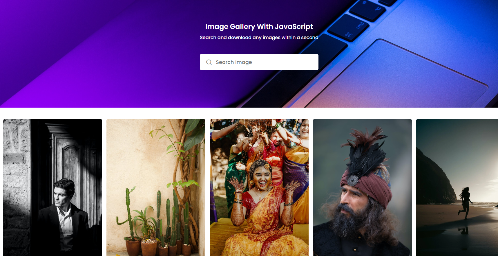

# Hello, my name is Christian 
* Project: Chriskolb00.photo.github.io
* Subject: An image generator app
* Purpose: practice of web api fetching and styling
* Tools used:
   javaScript
   html/css
   Vscode
   Vercel
* Instruction: Enter a search term and it will display image based on it
* <a href="https://chriskolb00-photogenerator.netlify.app" />Website
* 
